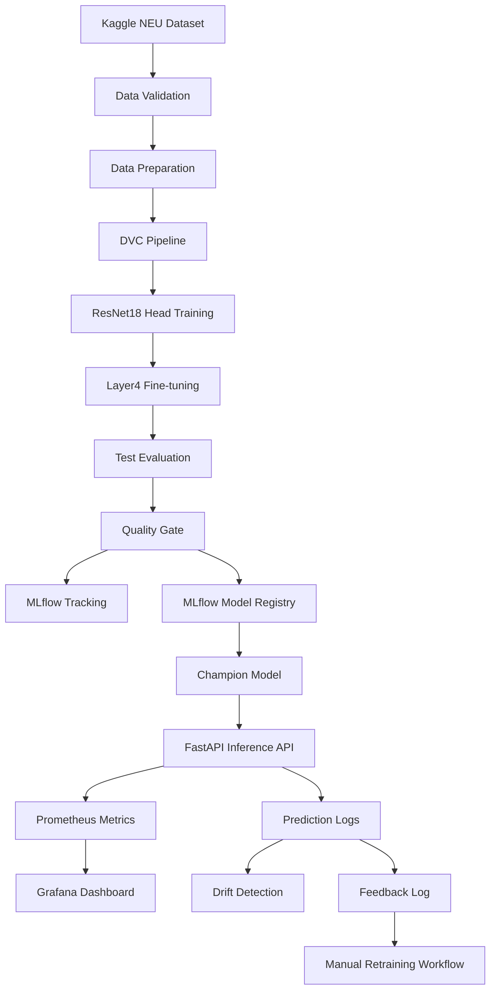

# VisionOps

Production-style computer vision MLOps pipeline for industrial steel surface-defect classification.

VisionOps classifies steel surface images into six defect classes using transfer learning with ResNet18. The project is designed to show the full machine learning lifecycle around a computer vision model: data validation, reproducible training, evaluation, model quality gates, experiment tracking, model registry, containerized inference, monitoring, drift detection, and a retraining workflow.

## Project Purpose

VisionOps is a portfolio project built to demonstrate the ability to deliver an end-to-end ML system, not just train a model in isolation.

The project showcases practical ML engineering and MLOps skills:

- validating and preparing real image data
- training and fine-tuning a pretrained computer vision model
- evaluating model quality with measurable gates
- tracking experiments and model versions with MLflow
- serving predictions through a FastAPI inference service
- containerizing the application with Docker
- monitoring prediction behavior with Prometheus and Grafana
- simulating production drift and generating drift reports
- wiring repeatable workflows with DVC and CI checks

Some parts intentionally simulate production conditions locally. The goal is to show sound engineering judgment, reproducibility, and end-to-end workflow design in a focused portfolio build.

## Problem

Industrial surface inspection systems need reliable defect classification so quality teams can detect issues earlier and reduce manual inspection load.

This project predicts one of these classes:

```text
crazing
inclusion
patches
pitted_surface
rolled-in_scale
scratches
```

## Dataset

This project uses the **NEU Surface Defect Database** downloaded from Kaggle.

Dataset source:

https://www.kaggle.com/datasets/kaustubhdikshit/neu-surface-defect-database

The downloaded dataset is stored locally under:

```text
data/raw/NEU-DET
```

The raw Kaggle dataset is not committed to Git. It is tracked with DVC.

Actual raw structure:

```text
data/raw/NEU-DET/
  train/images/<class_name>/*.jpg
  validation/images/<class_name>/*.jpg
```

The XML annotations are not used because this project is classification, not object detection. Class labels come from the image folder names.

Split strategy:

```text
train      = original Kaggle train split
validation = 50% of original Kaggle validation split
test       = 50% of original Kaggle validation split
```

## System Design



## Tech Stack

```text
Python 3.12
PyTorch
Torchvision
FastAPI
MLflow
DVC
Docker
Docker Compose
Prometheus
Grafana
Pytest
Ruff
GitHub Actions
```

## Current Results

Latest evaluated model:

```text
ResNet18 pretrained backbone
Phase 1: frozen backbone, train classifier head
Phase 2: unfreeze layer4, fine-tune layer4 + classifier head
```

Example test result:

```text
test accuracy: 0.98+
macro F1: 0.98+
quality gate: passed
```

Exact values are written to:

```text
artifacts/metrics.json
```

## API

Run locally:

```powershell
uvicorn api.main:app --reload
```

Open:

```text
http://127.0.0.1:8000/docs
```

Endpoints:

```text
GET  /health
GET  /model-info
POST /predict
POST /feedback
GET  /metrics
GET  /stats
```

Example prediction response:

```json
{
  "prediction_id": "generated-uuid",
  "prediction": "patches",
  "confidence": 0.9999,
  "probabilities": {
    "crazing": 0.0001,
    "inclusion": 0.0001,
    "patches": 0.9999,
    "pitted_surface": 0.0001,
    "rolled-in_scale": 0.0001,
    "scratches": 0.0001
  },
  "model_alias": "champion",
  "latency_ms": 62.8
}
```

## Docker Compose

Run the API, Prometheus, and Grafana:

```powershell
docker compose up --build
```

Services:

```text
FastAPI:    http://127.0.0.1:8001/docs
Prometheus: http://127.0.0.1:9090
Grafana:    http://127.0.0.1:3000
```

Grafana login:

```text
username: admin
password: admin
```

## DVC Pipeline

Run the reproducible ML pipeline:

```powershell
dvc repro
```

Current stages include:

```text
prepare
train
evaluate
quality_gate
register
promote
simulate_drift
drift_report
```

## MLflow

Open MLflow:

```powershell
mlflow ui
```

Then open:

```text
http://127.0.0.1:5000
```

MLflow tracks:

```text
training parameters
training and validation metrics
best model artifact
registered model versions
candidate/champion aliases
```

Registered model:

```text
visionops-defect-classifier
```

## Monitoring

The API exposes Prometheus metrics at:

```text
GET /metrics
```

Tracked metrics include:

```text
prediction requests
prediction errors
prediction latency
prediction confidence
predicted class distribution
active model alias
```

Grafana provides a dashboard for these metrics.

## Drift Detection

Create drifted images:

```powershell
python -m scripts.simulate_drift
```

Send drifted images to the API:

```powershell
python -m scripts.simulate_requests
```

Generate drift report:

```powershell
python -m src.monitoring.drift --last-n 180
```

Drift report output:

```text
artifacts/drift_report.json
```

The current drift demo darkens images and checks:

```text
average confidence
average brightness
predicted class distribution
```

## Retraining

Current retraining support is a manual workflow check:

```powershell
python -m src.retraining.retrain
```

The API logs:

```text
artifacts/predictions.jsonl
artifacts/feedback.jsonl
```

This project stores feedback metadata, not uploaded images. A production retraining system would need saved images or a reviewed labeled feedback dataset.

## Testing

Run tests:

```powershell
pytest -q
```

Run linting:

```powershell
ruff check .
```

GitHub Actions runs these checks on push.

## Screenshots

### FastAPI Swagger

The FastAPI Swagger page exposes the inference service endpoints for health checks, model metadata, prediction, feedback, metrics, and operational stats.


### Successful Prediction

The prediction endpoint accepts a steel surface image and returns the predicted defect class, confidence score, full probability distribution, model alias, latency, and prediction ID.


### Prometheus Targets

Prometheus successfully scrapes the FastAPI `/metrics` endpoint, confirming that the monitoring pipeline can collect API and model-serving metrics.


### Grafana Dashboard

Grafana visualizes the Prometheus metrics for request volume, errors, model confidence, latency, and predicted class distribution.


### MLflow Run

MLflow records evaluation metrics and model registration metadata, making model experiments traceable and comparable.


### MLflow Model Registry

The MLflow Model Registry tracks the registered classifier model and assigns the `champion` alias to the selected production candidate.


### Drift Report

The drift report summarizes production-like prediction logs and flags drift when image brightness, confidence, or class distribution moves beyond configured thresholds.


## Limitations

This is a local portfolio project. Docker Compose simulates a production-style stack, but it is not a real production deployment.

Current limitations:

```text
no Kubernetes
no cloud object storage DVC remote
no fully automated retraining
feedback logs do not store uploaded images
classification only, no bounding-box detection
```
