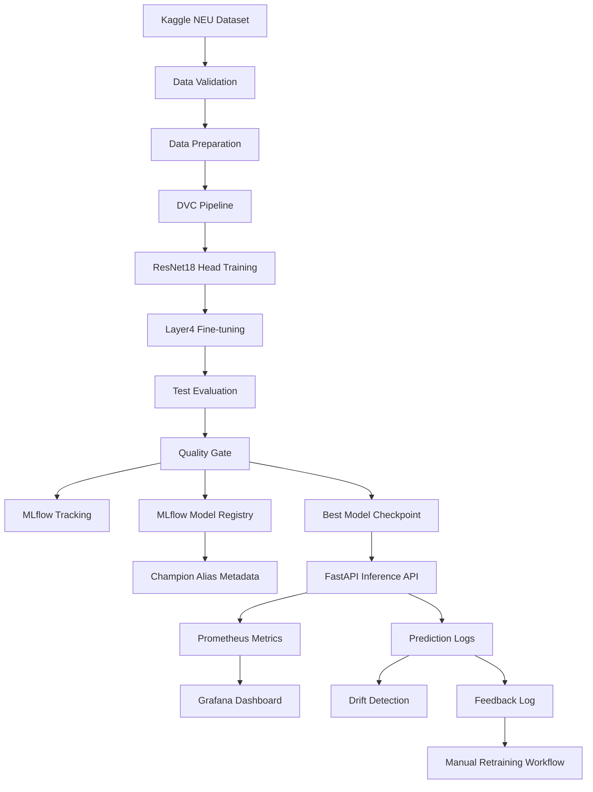
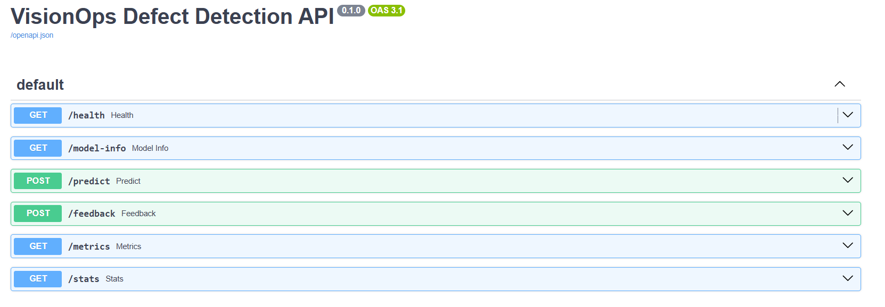
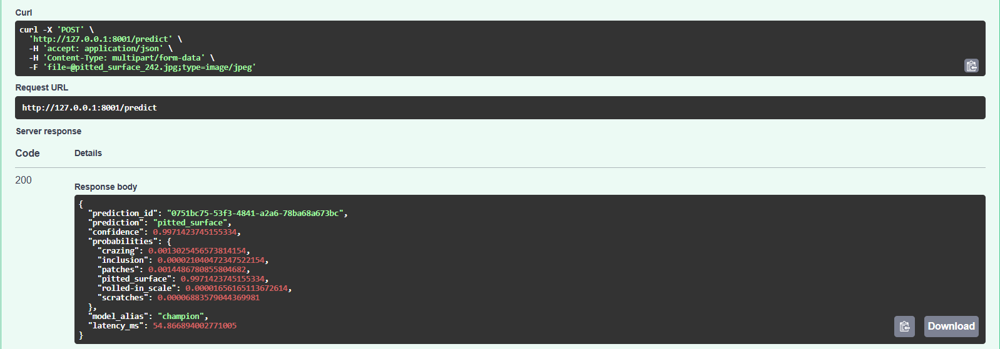
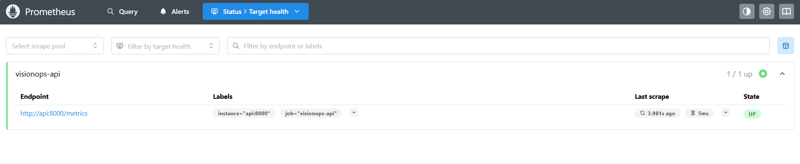
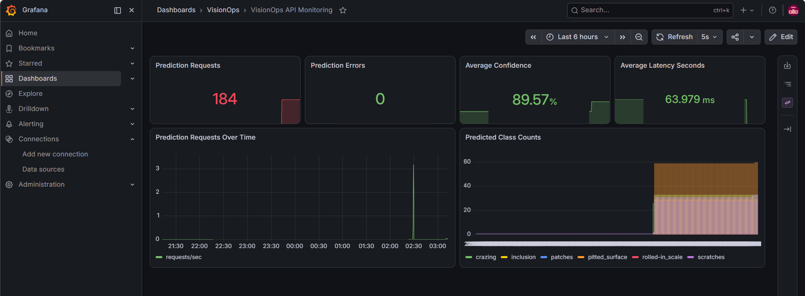
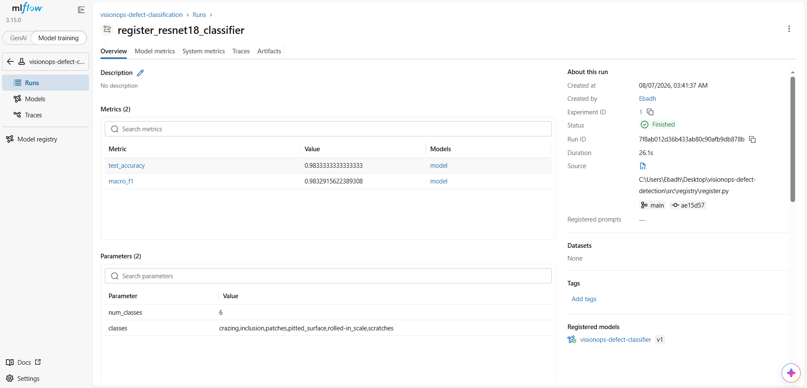
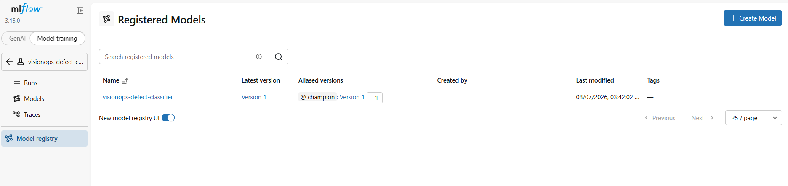
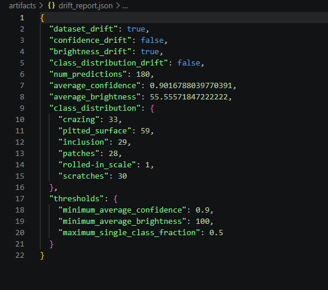

# VisionOps

Production-style computer vision MLOps pipeline for industrial steel surface defect classification.

VisionOps classifies steel surface images into six defect classes using transfer learning with ResNet18. The project demonstrates the full machine learning lifecycle around a computer vision model: data validation, reproducible training, evaluation, model quality gates, experiment tracking, model registry, containerized inference, monitoring, drift detection, and retraining readiness.

## Contents

- [Project Purpose](#project-purpose)
- [Dataset](#dataset)
- [Reproduce This Project](#reproduce-this-project)
- [System Design](#system-design)
- [Current Results](#current-results)
- [API](#api)
- [Docker Compose](#docker-compose)
- [DVC Pipeline](#dvc-pipeline)
- [MLflow](#mlflow)
- [Monitoring](#monitoring)
- [Drift Detection](#drift-detection)
- [Retraining](#retraining)
- [Screenshots](#screenshots)
- [Limitations](#limitations)

## Project Purpose

VisionOps is a portfolio project built to demonstrate the ability to deliver an end-to-end ML system, not just train a model in isolation.

The project showcases practical ML engineering and MLOps skills:

- validating and preparing real image data
- training and fine-tuning a pretrained computer vision model
- evaluating model quality with measurable gates
- tracking experiments and model versions with MLflow
- serving predictions through a FastAPI inference service
- containerizing the application with Docker
- monitoring prediction behavior with Prometheus and Grafana
- simulating production drift and generating drift reports
- wiring repeatable workflows with DVC and CI checks

Some parts intentionally simulate production conditions locally. The goal is to show sound engineering judgment, reproducibility, and end-to-end workflow design in a focused portfolio project.

## Problem

Industrial surface inspection systems need reliable defect classification so quality teams can detect issues earlier and reduce manual inspection load.

This project predicts one of these classes:

```text
crazing
inclusion
patches
pitted_surface
rolled-in_scale
scratches
```

## Dataset

This project uses the **NEU Surface Defect Database** downloaded from Kaggle.

Dataset source:

https://www.kaggle.com/datasets/kaustubhdikshit/neu-surface-defect-database

The downloaded dataset is stored locally under:

```text
data/raw/NEU-DET
```

The raw Kaggle dataset is not committed to Git. It is tracked with DVC.

Actual raw structure:

```text
data/raw/NEU-DET/
  train/images/<class_name>/*.jpg
  validation/images/<class_name>/*.jpg
```

The XML annotations are not used because this project is classification, not object detection. Class labels come from the image folder names.

Split strategy:

```text
train      = original Kaggle train split
validation = 50% of original Kaggle validation split
test       = 50% of original Kaggle validation split
```

## Reproduce This Project

Clone the repository:

```powershell
git clone https://github.com/ebad426623/visionops-defect-detection.git
cd visionops-defect-detection
```

Create and activate a virtual environment:

```powershell
python -m venv venv
.\venv\Scripts\Activate.ps1
```

Install dependencies:

```powershell
python -m pip install --upgrade pip
pip install -r requirements.txt
```

Commands below are shown for Windows PowerShell. On macOS or Linux, use the equivalent shell commands such as `source venv/bin/activate`, `mkdir -p`, and `mv`.

Download the dataset with the Kaggle CLI. Kaggle API authentication is required before running this command.

```powershell
mkdir data\downloads
kaggle datasets download -d kaustubhdikshit/neu-surface-defect-database -p data/downloads --unzip
```

Prepare the raw dataset folder. If Kaggle downloads a nested `NEU-DET.zip`, extract it:

```powershell
mkdir data\raw
tar -xf data\downloads\NEU-DET.zip -C data\raw
```

If Kaggle extracts `NEU-DET` directly inside `data/downloads`, move it instead:

```powershell
mkdir data\raw
move data\downloads\NEU-DET data\raw\NEU-DET
```

The final folder structure should be:

```text
data/raw/NEU-DET/
  train/images/
  validation/images/
```

Start MLflow first so DVC training runs can be tracked:

```powershell
docker compose up -d mlflow
$env:MLFLOW_TRACKING_URI="http://127.0.0.1:5000"
```

Run the reproducible training and evaluation pipeline:

```powershell
dvc repro quality_gate
```

After training creates `artifacts/best_model.pt`, keep MLflow running and start the API and monitoring services:

```powershell
docker compose up --build api prometheus grafana
```

See the Docker Compose section for service URLs.

## System Design



## Tech Stack

```text
Python 3.12
PyTorch
Torchvision
FastAPI
MLflow
DVC
Docker
Docker Compose
Prometheus
Grafana
Pytest
Ruff
GitHub Actions
```

## Current Results

Latest evaluated model:

```text
ResNet18 pretrained backbone
Phase 1: frozen backbone, train classifier head
Phase 2: unfreeze layer4, fine-tune layer4 + classifier head
```

ResNet18 was chosen because it is lightweight enough for local training and Docker-based serving, while still providing strong pretrained image features. The model first trains only the classifier head to adapt ImageNet features to defect classes, then fine-tunes `layer4` because it contains the highest-level visual features most relevant to the new classification task.

Example test result:

```text
test accuracy: 0.9944
macro F1: 0.9944
quality gate: passed
```

Exact values are written to:

```text
artifacts/metrics.json
```

The NEU dataset is small and class-balanced, so high accuracy is plausible but should not be interpreted as proof of production readiness on unseen factory data. The value of this project is the end-to-end ML workflow around the model, not only the headline metric.

## API

The FastAPI service is started through Docker Compose. See the Docker Compose section for the API URL.

Endpoints:

```text
GET  /health
GET  /model-info
POST /predict
POST /feedback
GET  /metrics
GET  /stats
```

Example prediction response:

```json
{
  "prediction_id": "generated-uuid",
  "prediction": "patches",
  "confidence": 0.9999,
  "probabilities": {
    "crazing": 0.0001,
    "inclusion": 0.0001,
    "patches": 0.9999,
    "pitted_surface": 0.0001,
    "rolled-in_scale": 0.0001,
    "scratches": 0.0001
  },
  "model_alias": "champion",
  "latency_ms": 62.8
}
```

## Docker Compose

Services:

```text
FastAPI:    http://127.0.0.1:8001/docs
MLflow:     http://127.0.0.1:5000
Prometheus: http://127.0.0.1:9090
Grafana:    http://127.0.0.1:3000
```

Grafana login:

```text
username: admin
password: admin
```

## DVC Pipeline

The main reproduction command runs the pipeline through `quality_gate`.

Stages:

```text
prepare
train
evaluate
quality_gate
register
promote
simulate_drift
drift_report
```

The drift stages depend on production-style prediction logs. Run the API and send prediction requests before running:

```powershell
dvc repro drift_report
```

## MLflow

MLflow runs as part of the Docker Compose stack and is used for experiment tracking and model registry management.

Before running DVC training, set `MLFLOW_TRACKING_URI` so runs are logged to the Docker MLflow server.

MLflow tracks:

```text
training parameters
training and validation metrics
best model artifact
registered model versions
candidate/champion aliases
```

Registered model:

```text
visionops-defect-classifier
```

The FastAPI service currently loads the local checkpoint from `artifacts/best_model.pt`. The MLflow registry is used to demonstrate model versioning and champion alias management.

## Monitoring

The API exposes Prometheus metrics at:

```text
GET /metrics
```

Tracked metrics include:

```text
prediction requests
prediction errors
prediction latency
prediction confidence
predicted class distribution
active model alias
```

Grafana provides a dashboard for these metrics.

## Drift Detection

Create drifted images:

```powershell
python -m scripts.simulate_drift
```

Send drifted images to the API:

```powershell
python -m scripts.simulate_requests
```

Generate drift report:

```powershell
python -m src.monitoring.drift --last-n 180
```

Drift report output:

```text
artifacts/drift_report.json
```

The current drift demo darkens images and checks:

```text
average confidence
average brightness
predicted class distribution
```

## Retraining

Current retraining support is a manual readiness check:

```powershell
python -m src.retraining.retrain
```

The check verifies that prediction logs, feedback logs, and the current best checkpoint exist before a reviewed retraining workflow is started.

The API logs:

```text
artifacts/predictions.jsonl
artifacts/feedback.jsonl
```

This project stores feedback metadata, not uploaded images. A production retraining system would need saved images or a reviewed labeled feedback dataset.

## Testing

Run tests:

```powershell
pytest -q
```

Run linting:

```powershell
ruff check .
```

GitHub Actions runs these checks on push.

## Screenshots

### FastAPI Swagger

The FastAPI Swagger page exposes the inference service endpoints for health checks, model metadata, prediction, feedback, metrics, and operational stats.



### Successful Prediction

The prediction endpoint accepts a steel surface image and returns the predicted defect class, confidence score, full probability distribution, model alias, latency, and prediction ID.



### Prometheus Targets

Prometheus successfully scrapes the FastAPI `/metrics` endpoint, confirming that the monitoring pipeline can collect API and model-serving metrics.



### Grafana Dashboard

Grafana visualizes the Prometheus metrics for request volume, errors, model confidence, latency, and predicted class distribution.



### MLflow Run

MLflow records evaluation metrics and model registration metadata, making model experiments traceable and comparable.



### MLflow Model Registry

The MLflow Model Registry tracks the registered classifier model and assigns the `champion` alias to the selected production candidate.



### Drift Report

The drift report summarizes production-like prediction logs and flags drift when image brightness, confidence, or class distribution moves beyond configured thresholds.



## Limitations

This is a local portfolio project. Docker Compose simulates a production-style stack, but it is not a real production deployment.

Current limitations:

```text
no Kubernetes
no cloud object storage DVC remote
no fully automated retraining
feedback logs do not store uploaded images
classification only, no bounding-box detection
```

## License

This project is licensed under the MIT License — see the [LICENSE](LICENSE) file for details.
